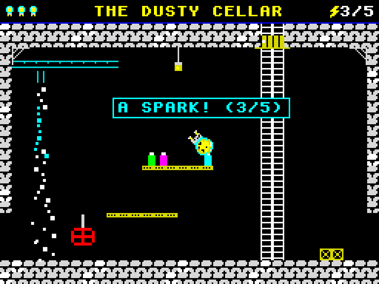

# Zizzy

A flip-screen 8-bit adventure for the browser. Zizzy, a little glowing radio
valve, has rolled out of the grand old wireless and into the cellar of an
abandoned radio station. Find five sparks and climb back up to the attic to
make the radio sing again.

**Play:** [kothf.github.io/zizzy](https://kothf.github.io/zizzy/) ·
also on [aerocat.tech/games](https://aerocat.tech/games/)



## The game

Five rooms: the Dusty Cellar, the Boiler Room, the Flooded Tunnel, the Workshop
and the Radio Attic. Each one has a puzzle: a scalding steam leak, a rusted
trapdoor, a raft across deep water, a crackling Tesla coil and a robot called
Sprocket who won't let anyone pass. Zizzy can carry two things at once, so
think about what to take where.

| | Keyboard | Touch |
|---|---|---|
| Walk | ← → or A D (O P) | ◀ ▶ |
| Jump (somersault while moving) / climb up | ↑ or W (Q) | ▲ |
| Climb down | ↓ or S | ▼ |
| Use / talk / next | Space or Enter | USE |
| Pick up / drop | E (G) | PICK / DROP |
| Choose hand | Tab, 1, 2 | tap a hand |
| Sound on/off | M | SOUND |
| Restart | R twice | — |

## How it's built

Plain JavaScript and a 256×192 canvas, no libraries and no image files: every
sprite, tile, the font and the music are drawn or synthesised in code.

- **One map per room drives both drawing and collision**, so the scenery you
  see is exactly what Zizzy stands on. Rooms join on a grid; walking or
  climbing between them keeps Zizzy's exact position, and a test checks that
  every doorway lines up with its neighbour at the same floor height.
- **Fixed 50 Hz simulation** with an accumulator, so the game runs at the same
  speed on 60, 120 or 144 Hz displays. Frames are drawn only after the state
  changes; static room scenery is drawn once and cached, text glyphs are
  pre-rendered.
- Tile physics with one-way planks, ladders (including one that continues
  through a trapdoor into the room above), a moving raft that carries Zizzy,
  an 8 px auto-step and mid-air ledge forgiveness.
- The somersault uses pre-rotated sprite frames with nearest-neighbour
  sampling, so it stays pixel-crisp.
- Sound effects and the victory tune come from a small Web Audio "beeper".

## Run it locally

```sh
python3 -m http.server 8080   # then open http://localhost:8080/
```

## Development

```sh
npm ci
npx playwright install chromium
npm test            # world consistency tests + a bot that plays the whole game
npm run package     # dist/zizzy/ and a versioned .tar.gz
```

The end-to-end test drives the game through the same inputs a player uses
(keys held tick by tick): it rides the raft, catches the floating spark, opens
the trapdoor, times the jump past the Tesla coil and wins, then checks deaths,
respawning, game over and the 50 Hz timing.

Pages load their scripts with `?v=dev`; packaging stamps the release version
into every asset URL so browsers and CDNs never mix two versions.

### Releasing

1. Add the changes under a new version in `CHANGELOG.md`.
2. Bump `version` in `package.json`.
3. `git tag vX.Y.Z && git push origin main vX.Y.Z`

The Release workflow tests the source and the packaged build, publishes a
GitHub release with `zizzy-X.Y.Z.tar.gz` and its SHA-256 (byte-for-byte
reproducible), and deploys GitHub Pages. [aerocat.tech](https://aerocat.tech)
embeds released versions only, pinned by version and checksum.

## Credits

Inspired by the flip-screen puzzle adventures of the 8-bit era. All code,
characters, artwork, text and music are original.

## License

[MIT](LICENSE) © Andrey Dumchin
